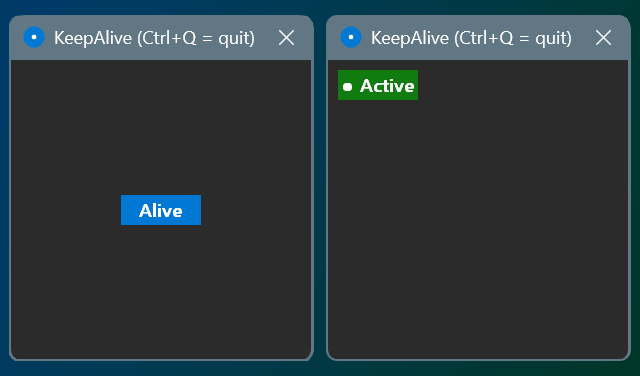

# Clicky — KeepAlive

Tiny cross-platform utility that keeps your PC/Mac awake by simulating mouse clicks.

## Features

- **Auto-clicker** — cursor moves along Bezier curves with random offset + periodic clicks
- **Prevents sleep** — blocks display & system idle timeout
- **Always on top** — small 300x300 window stays visible
- **Random delay** — 1-5 sec between movement cycles
- **Dark theme** — flat UI, no external dependencies
- **Hotkey** — Ctrl+Q (Windows) / Cmd+Q (macOS) to quit

## Usage

1. Launch `clicky` (or `clicky.exe` on Windows)
2. Click the **Alive** button — it turns green (**Active**)
3. The cursor moves to button corners with random delays, simulating clicks
4. Press **Ctrl+Q** / **Cmd+Q** to quit

## Build

**Windows:**

```bash
cd src
go build -ldflags="-H windowsgui" -o ../dist/clicky.exe
```

**macOS:**

```bash
cd src
CC=clang go build -o ../dist/clicky
```

## Project Structure

```
src/
  main.go                  — Entry point
  app.go                   — Shared logic: Bezier curves, random delay, aliveLoop
  platform_windows.go      — Win32 GUI + mouse + sleep prevention
  platform_macos.go        — macOS: Cocoa + CoreGraphics + IOKit (cgo)
  icon.go                  — Embedded app icon (icon.png)
  icon.png                 — App icon
  rsrc_windows_amd64.syso  — Windows resource (embedded icon for .exe)
  go.mod
dist/                      — Build output (gitignored)
```

## Design



| Element | Color |
|---------|-------|
| Background | `#2B2B2B` |
| Button (idle) | `#0078D4` |
| Button (active) | `#107C10` |
| Text | `#FFFFFF` |
| Font | Segoe UI, semi-bold |

## Requirements

- **Windows:** Windows 10+, Go 1.21+, no CGO
- **macOS:** macOS 10.14+, Go 1.21+, Xcode CLT (for cgo), Accessibility permission for mouse control
